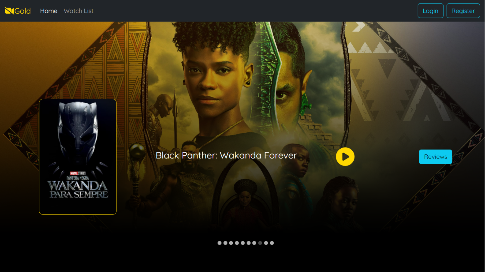
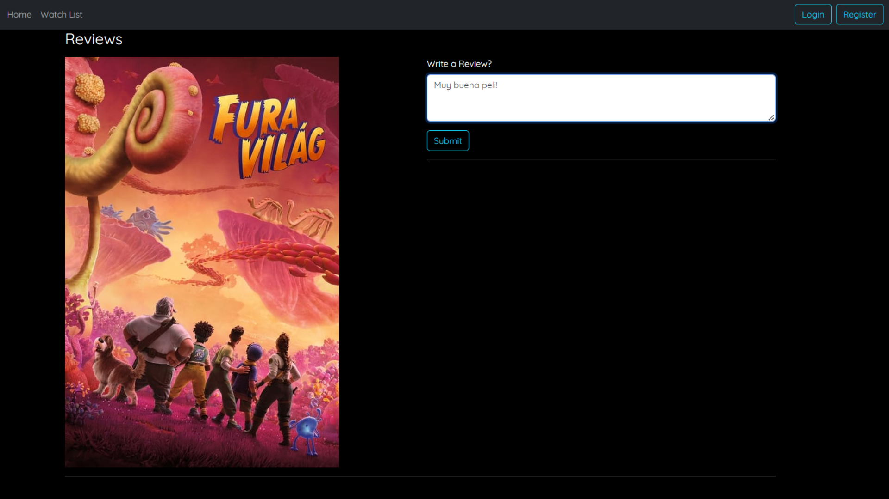

# Movie Review App

## Descripción
Movie Review App es una aplicación web que permite a los usuarios buscar películas, ver detalles y dejar reviews. El backend se conecta con una API pública de películas para obtener información actualizada y los reviews se almacenan en una base de datos MongoDB. Los usuarios pueden crear una lista personalizada de películas y añadir sus reviews.

## Tecnologías Utilizadas

 ### Frontend tech
- Node.js y npm
- React.js
- Material-UI
- Bootstrap
- Axios

 ### Backend tech
- Java
- SpringBoot
- Lombok
- Spring-dotenv
- MongoDB


## Imágenes





## Instalación y Configuración

### Frontend
1. Clonar el repositorio.
   ```bash
   git clone <repo-url>
   cd frontend

2. Instalar las dependencias.
    ```bash
    npm install

3. Iniciar la aplicación.
 ```bash
    npm start  
 ```

###Backend
1. Clonar el repositorio.
   ```bash
   git clone <repo-url>
   cd backend

2. Configura las variables de entorno en un archivo .env.
    ```bash
    .env.explample

3. Compilar y ejecuta la aplicación.
 ```bash
    ./mvnw spring-boot:run  
 ```
 (La app tiene configurado cors para un entorno de desarrollo - para producción deberas cambiarlo.)

 
